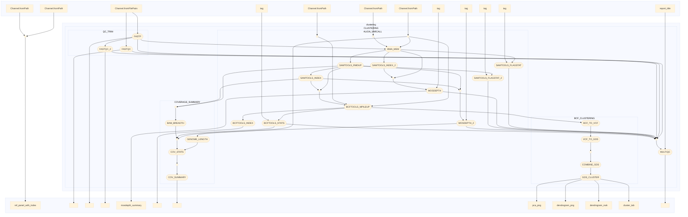

# varcallimputblup
Nextflow pipeline for variant calling, imputation and cattle model construction

```
nextflow run -latest glebus-sasha/varcallimputblup -params-file params.yaml -profile mamba
```



FASTQC: Quality control of raw sequencing data using FastQC.

FASTP: Trimming of reads to remove adapters and low-quality sequences using fastp.

BWA_MEM: Alignment of reads to the reference genome using BWA MEM.

SAMTOOLS_FLAGSTAT: Quality assessment of alignment using SAMtools flagstat.

SAMTOOLS_INDEX: Indexing of BAM files using SAMtools index.

MOSDEPTH: Calculation of sequencing depth using mosdepth.

SAMTOOLS_RMDUP: Removal of PCR duplicates using SAMtools rmdup.

BCFTOOLS_MPILEUP: Variant calling using BCFtools mpileup.

BCFTOOLS_INDEX: Indexing of VCF files using BCFtools index.

BCFTOOLS_STATS: Statistical analysis of variant calls using BCFtools stats.

BAM_BREADTH: Calculation of breadth of coverage using BAM files.

GENOME_LENGTH: Calculation of genome length.

COV_STATS: Statistical analysis of coverage using coverage statistics.

COV_SUMMARY: Summary of coverage statistics.

BCF_TO_VCF: Conversion of BCF files to VCF format.

VCF_TO_GDS: Conversion of VCF files to GDS format.

COMBINE_GDS: Combining multiple GDS files.

GDS_CLUSTER: Clustering of GDS files.
MULTIQC: Compilation of a comprehensive report including QC metrics, alignment results, and variant calling statistics.
